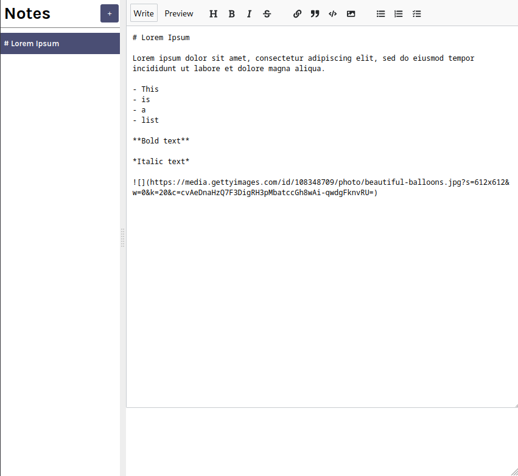
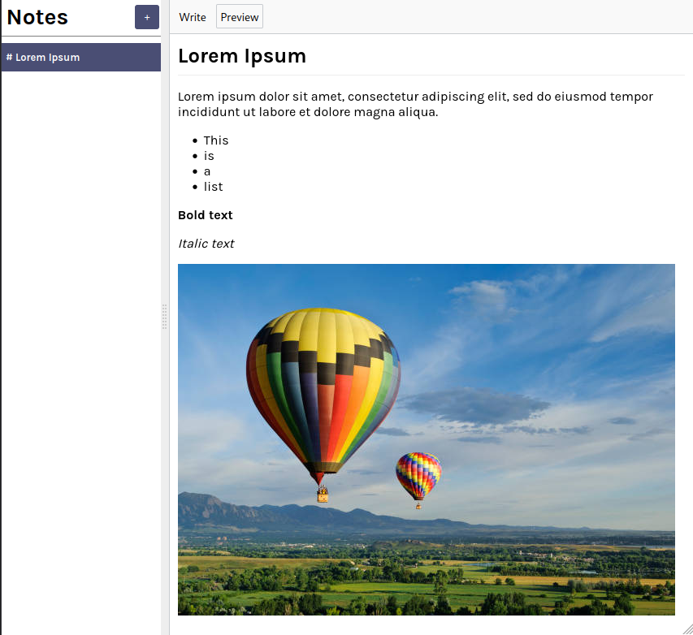

# Markdown Notes App

Create, edit and live preview your markdown notes with this React app!

## Preview

## Running on your machine

To run this project locally, follow these steps:

1. Clone the repository
   (`git clone https://github.com/caiohenrique-3/markdown-notes-app.git`)

2. Navigate to the project directory (`cd markdown-notes-app`)

3. Install dependencies (`npm install`)

4. Start the development server (`npm run dev`)

The project will be accessible at http://127.0.0.1:8080.

## What I learned

In this Markdown Notes React application, I honed my ability to navigate and
work with an existing codebase. This experience allowed me to gain proficiency
in adding new features to an already existing project. Additionally, I
strengthened my skills in tasks like array manipulation, proficiently managing
npm packages, and effectively utilizing localStorage for data storage.

## Acknowledgments

Special thanks to the following resources for their contributions to this
project:

- [Google Webfonts Helper](https://gwfh.mranftl.com/fonts)
- [React Course](https://youtube.com/watch?v=bMknfKXIFA8)
- [react-mde](https://github.com/andrerpena/react-mde/tree/master)
- [Showdown](https://github.com/showdownjs/showdown)
- [react-split](https://github.com/nathancahill/split)
- [nanoid](https://github.com/ai/nanoid)

## License

This project is licensed under the [MIT License](LICENSE).

---
